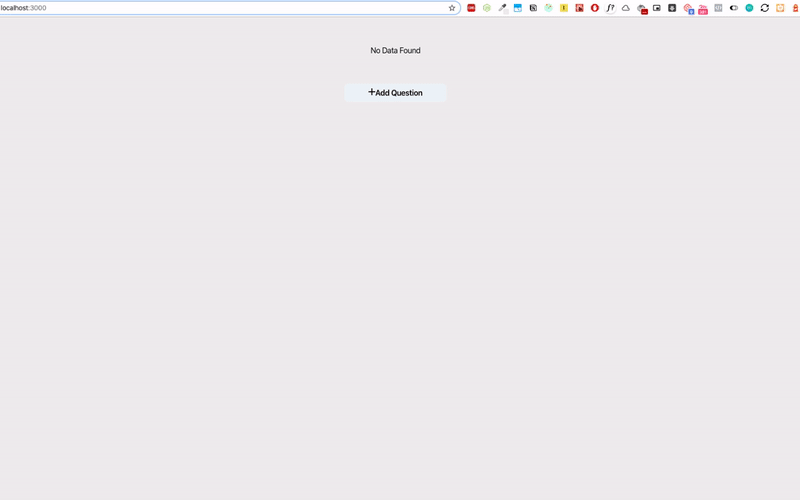

# [follow this tutorials](https://dev.to/ganeshmani/modern-react-redux-tutorials-with-redux-toolkit-2020-2b6)
## Modern React Redux Tutorial with Redux toolkit

This Repo demostrates the Modern React Redux application development with Redux toolkit.



##### Using Create React App

```
npx create-react-app my-app --template redux
```

##### An Existing App

```
# NPM
npm install @reduxjs/toolkit

# Yarn
yarn add @reduxjs/toolkit
```

##### To Run this App

```
npm install

npm run start
```